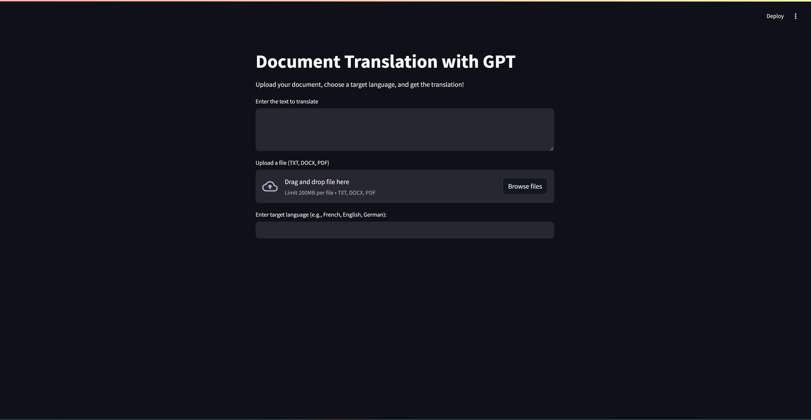
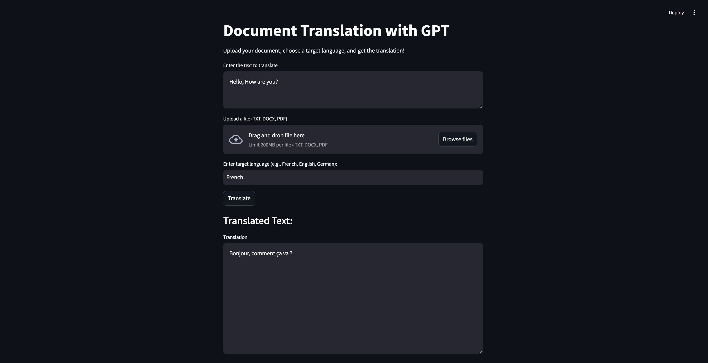
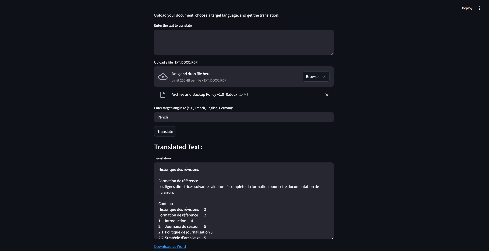

# Document Translation with OpenAI

## Project Description

This project provides document translation from English to various other languages using the OpenAI API. It allows users to translate text either by entering it into a text area or by uploading a Word or PDF file. The translated text can then be downloaded as a Word document.

## Setup Instructions

1.  Install the required dependencies using pip:

    ```bash
    pip install -r requirements.txt
    ```

## Usage Examples

1.  **Text Area Translation:** Enter the English text into the provided text area field and select the target language. The translated text will be displayed, and you can download it as a Word document.
2.  **File Upload Translation:** Upload a Word or PDF file containing the English text you want to translate. Select the target language. The translated text will be generated, and you can download it as a Word document.

## Configuration

The project requires an OpenAI API key, which should be stored in a `.env` file. Create a `.env` file in the project root directory and add the following line, replacing `YOUR_API_KEY` with your actual API key:

    OPENAI_API_KEY=YOUR_API_KEY

## UI Screens

This section will provide screenshots of the user interface to guide users on how to interact with the application.

*   **Main Translation Interface:**  




*   **Translation Result:** 

